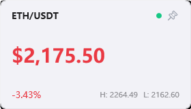

# ETH Price Monitor

A lightweight Windows desktop widget that displays real-time ETH/USDT price from Binance WebSocket stream.


## Features

- **Real-time Price** — ETH/USDT ticker via Binance WebSocket with auto-reconnect
- **Floating Widget** — Always-on-top borderless window with price, 24h change, and high/low
- **Pin / Click-Through** — Pin the widget to make it click-through so you can work underneath; unpin to drag and move
- **Price Alerts** — Configurable threshold alerts with Windows Toast notifications and cooldown
- **System Tray** — Minimizes to tray with context menu (show/hide, unpin, settings, exit)
- **Auto-Start** — Option to launch with Windows startup
- **Opacity & Topmost** — Adjustable window opacity and always-on-top toggle
- **Dark/Light Theme** — Follows system theme preference automatically

## Screenshots

*Floating widget (light theme, unpinned — draggable)*



## Getting Started

### Prerequisites

- Windows 10 1809+ or Windows 11
- [.NET 8 SDK](https://dotnet.microsoft.com/download/dotnet/8.0)

### Build & Run

```bash
git clone https://github.com/redcatH/EthPriceMonitor.git
cd EthPriceMonitor
dotnet run --project src/EthPriceMonitor/EthPriceMonitor.csproj
```

### Publish Single File

```bash
dotnet publish src/EthPriceMonitor/EthPriceMonitor.csproj -c Release -r win-x64 --self-contained -p:PublishSingleFile=true
```

## Usage

| Action | How |
|---|---|
| Move the widget | Drag the top bar (ETH/USDT area) |
| Pin (click-through) | Click the 📌 pin button — widget becomes transparent to mouse clicks |
| Unpin | Right-click tray icon → "取消置顶" |
| Configure alerts | Right-click tray icon → "设置..." |
| Show / Hide widget | Right-click tray icon → "显示/隐藏悬浮窗", or double-click tray icon |

## Tech Stack

- **WPF .NET 8** — UI framework
- [Hardcodet.NotifyIcon.Wpf](https://github.com/hardcodet/netnotifyicon) — System tray icon
- [Microsoft.Extensions.DependencyInjection](https://learn.microsoft.com/dotnet/core/extensions/dependency-injection) — DI container
- [Microsoft.Toolkit.Uwp.Notifications](https://learn.microsoft.com/windows/apps/design/shell/tiles-and-notifications/adaptive-interactive-toasts) — Windows Toast notifications
- **Binance WebSocket API** — `wss://data-stream.binance.com/ws/ethusdt@ticker`
- **Win32 API** — `WS_EX_TRANSPARENT` for click-through mode

## Project Structure

```
src/EthPriceMonitor/
├── App.xaml.cs              # Startup, DI, WebSocket wiring
├── Converters/
│   ├── PriceColorConverter.cs   # Bool → green/red brush
│   └── PinToolTipConverter.cs   # Bool → pin tooltip text
├── Models/
│   ├── AlertThreshold.cs        # Price alert config
│   ├── AppSettings.cs           # Persisted settings
│   └── TickerData.cs            # Binance ticker model
├── Services/
│   ├── BinanceWebSocketService.cs  # WebSocket client + auto-reconnect
│   ├── AlertEngine.cs              # Threshold monitoring + cooldown
│   ├── ThemeService.cs             # System dark/light detection
│   ├── AutoStartService.cs         # Windows startup registration
│   └── WindowsToastNotificationService.cs
├── ViewModels/
│   ├── MainViewModel.cs        # Price display + pin toggle
│   ├── SettingsViewModel.cs    # Alert thresholds + preferences
│   └── TrayIconViewModel.cs    # Tray menu commands
└── Views/
    ├── FloatingWindow.xaml(.cs)  # Borderless price widget
    ├── SettingsWindow.xaml(.cs)  # Alert & preference editor
    └── TrayIcon.xaml             # Tray icon + context menu
```

## License

MIT
